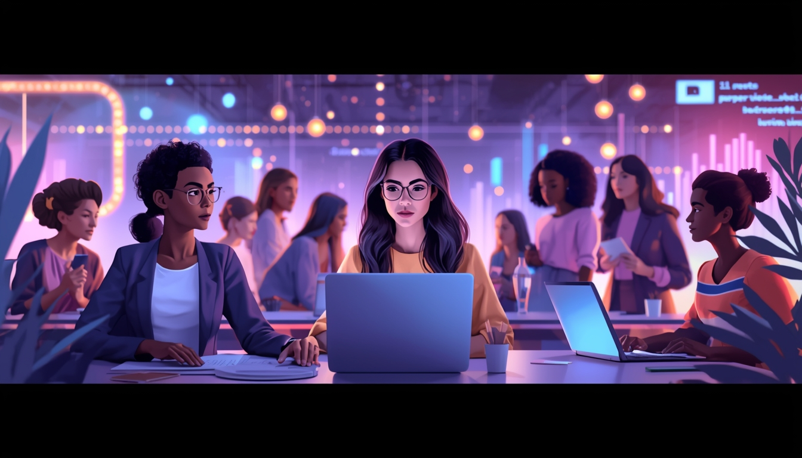

# She Ships - Hackathon


# She Builds
---

## Descripción
Este proyecto será desarrollado como parte de la Hackathon de She Ships, realizada durante 48 horas del 6 al 8 de marzo. Durante este espacio, estaremos aprendiendo, colaborando y construyendo junto a mujeres increíbles de distintas áreas.

El objetivo del proyecto es contribuir a disminuir las barreras que enfrentan muchas mujeres al realizar una transición de carrera, como la brecha de oportunidades y la brecha salarial. A través de esta iniciativa buscamos facilitar el acceso a aprendizaje, orientación y recursos que les permitan tomar decisiones informadas y ampliar sus oportunidades profesionales.

## Problema
Las mujeres que buscan transicionar al sector tecnológico enfrentan una triple brecha: falta de tiempo por labores de cuidado, barreras económicas e invisibilidad de sus habilidades previas. Esta desorientación, sumada a mitos limitantes y la ausencia de referentes o mentoras, genera estancamiento, síndrome del impostor y frena la innovación diversa en la industria.

## Solución
Una plataforma de transición profesional que desbloquea el potencial femenino mediante una IA de Re-skilling inteligente; nuestra plataforma utiliza un motor de lenguaje avanzado para traducir experiencias de vida y cuidados en competencias técnicas validadas, eliminando la invisibilidad del talento previo. Resolvemos la pobreza de tiempo mediante una Ruta de Micro-aprendizaje en cápsulas de 15 minutos y derribamos la barrera económica a través de una Economía de Créditos de Talento —donde el conocimiento se intercambia como moneda entre mentoras y aprendices— complementada con el financiamiento flexible de Sezzle.

## Características
* Recomendación de recursos de estudio 
* Orientación en la transición de profesión
* Crecimiento personal y profesional
* Mentorias
* Networking


### Tecnologías
* Figma

### Instalación
```bash
git clone https://github.com/Shiuu28/SheShips---Hackathon.git
cd SHESHIPS---HACKATHON
```

#### Equipo
* Katty Aquino → Frontend
* Alondra Leon → UX/UI
* Fatima Zelaya → Full Stack
* María Gonzales → Herramientas No Code (Lovable) & Biologa y Docente
* Shiuu Valenzuela → AI & QA